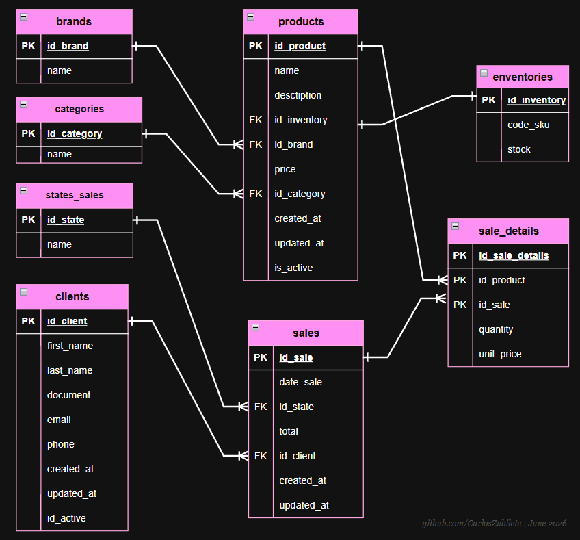
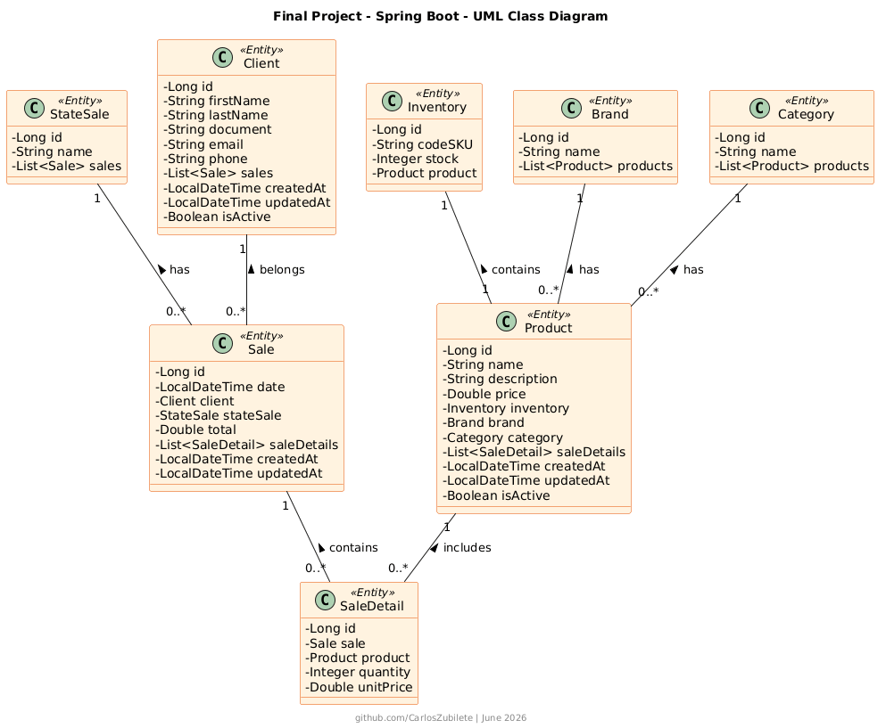

# Final Work - 🐾 PetShop API - E-commerce Backend

A RESTful API developed with Spring Boot as the final project for the course "*Development of APIs with Spring Boot*" from [todocodeacademy](https://todocodeacademy.com/course/desarrollo-de-apis-con-spring-boot/) 

This project simulates comprehensive management of a Pet Shop. The system allows managing products, inventory, clients, and the complete sales cycle, designed to be consumed by both web and mobile applications.

---

## 🏗️ Architecture and Data Design

For this project, according to the specifications in the [final-project](utils/ProyectoFinalTodoCodeSpringBoot.pdf), we chose a relational database design using PostgreSQL, modeled through JPA/Hibernate. The design not only meets the basic requirements but also incorporates real-world practices to ensure scalability and data integrity in an e-commerce system.

### 📊 Data Modeling (Entity-Relationship Diagram)

Database structure with all tables, relationships, and cardinalities.

This diagram shows:

- All tables and columns.
- Primary and foreign keys.
- Relationships between tables (1 to N, N to M, etc.).

### 🏛️ Class Diagram (UML)

The UML class diagram reflects the data modeling at the code level, showing JPA entities, their attributes, methods, and relationships.

You can observe:

- The classes that represent database tables.
- JPA annotations for ORM mapping.
- Relationships between classes (composition and bidirectional).

### 💡 Critical Decisions and Benefits

1. **Product and Inventory Separation (SKU Usage):** Instead of handling stock directly in the products table, an independent `Inventory` entity was created, linked via the SKU code (Stock Keeping Unit).
   - **Benefit:** Allows differentiating exact presentations of the same product (e.g., 3kg food vs 15kg). Additionally, it prepares the architecture for future migration to microservices, where inventory could be managed by an external and independent service.

2. **Logical Deletes (Soft Deletes):**
   The `is_active` field was implemented in critical entities such as `Product` and `Client`.
   - **Benefit:** Prevents loss of referential integrity. If a product stops being sold or a client is deactivated, a `DELETE` command is not executed on the database. This preserves the sales history (`Sale` and `SaleDetail`) intact for accounting reports and business metrics.

3. **Automated Auditing:**
   The `created_at` and `updated_at` fields were incorporated, automatically managed by Spring (`@CreationTimestamp`, `@UpdateTimestamp`).
   - **Benefit:** Facilitates tracking of modifications, vital for technical support and for generating daily sales reports and new client registrations.

4. **Standardization of Sale States:**
   Instead of using a simple `String` or rigid `Enum` for the sale state, the `StateSale` entity was created.
   - **Benefit:** Allows adding new states in the future (e.g., "Pending", "Packaged", "In Transit", "Delivered") directly from the database without needing to recompile and redeploy the application.

5. **Layered Validations:**
   The responsibility for structural integrity was delegated to Entities (e.g., `@Column(unique = true)` for emails and documents), leaving syntactic validation to the DTOs and semantic validation (business rules) to the Service layer.
